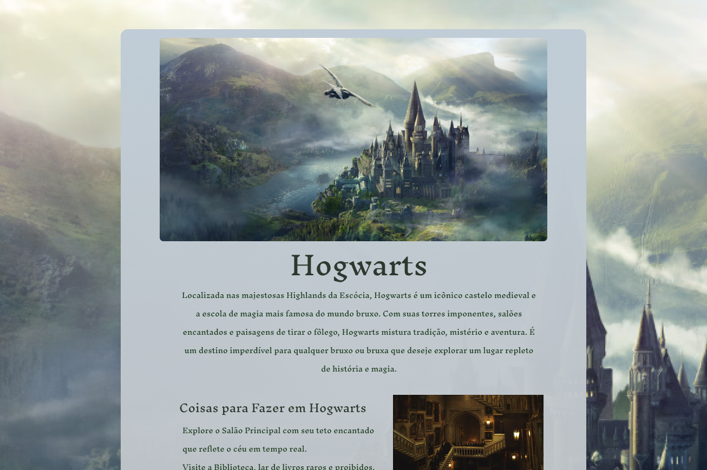

<h1 align="center"> Bem vindos a Hogwarts</h1>

Página WEB.

  <a href="#-tecnologias">Tecnologias</a>&nbsp;&nbsp;&nbsp;|&nbsp;&nbsp;&nbsp;
  <a href="#-projeto">Projeto</a>&nbsp;&nbsp;&nbsp;|&nbsp;&nbsp;&nbsp;
  <a href="#-layout">Layout</a>&nbsp;&nbsp;&nbsp;|&nbsp;&nbsp;&nbsp;
  <a href="#memo-licença">Licença</a>

  

 

  

## 🚀 Tecnologias

Esse projeto foi desenvolvido com as seguintes tecnologias:

- HTML e CSS
- Git e Github
 - Figma

## 💻 Projeto
Página de turismo sobre Hogwarts, projeto de materia na Rockseat, focando no estudo de Html e CSS

## :memo: Licença

Esse projeto está sob a licença MIT.

---

